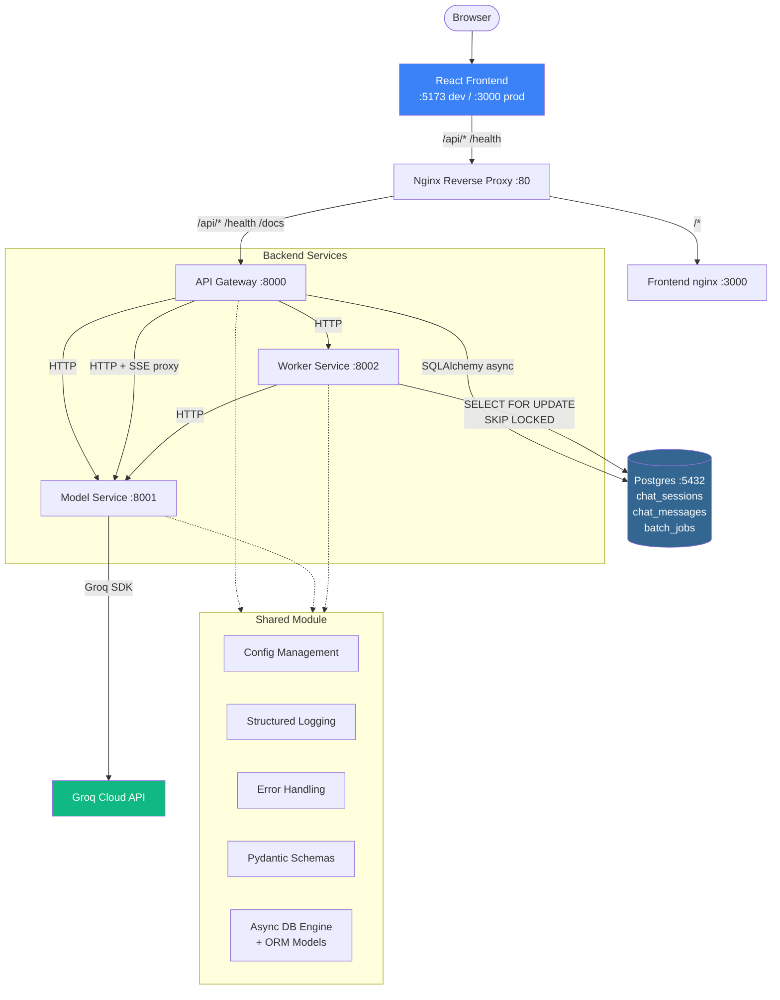

# Prodigon - Learn Production AI System Design

A multi-service AI assistant platform built for teaching production system design patterns, scalability, and security. Includes a polished React frontend with streaming chat, a system dashboard, and batch job management — all backed by Postgres for durable session and job state.

## Architecture



> **Dev mode:** Vite on `:5173` proxies `/api/*` and `/health` directly to the API Gateway on `:8000` — no Nginx needed.
>
> **Docker mode:** Nginx on `:80` routes `/api/*` to the Gateway and `/*` to the Frontend container.

## Request Flow

**Streaming chat (primary flow):**
1. Browser sends `POST /api/v1/generate/stream` through the Vite proxy (dev) or Nginx (prod)
2. **API Gateway** proxies the request as an SSE stream to **Model Service**
3. **Model Service** calls **Groq API** with `stream=True`, yields tokens as `data: token\n\n` events
4. Tokens flow back through the Gateway to the browser in real-time
5. Frontend parses SSE events and appends each token to the chat message

**Synchronous generation:**
1. Browser sends `POST /api/v1/generate` to the **API Gateway**
2. Gateway adds request ID, logs the request, and proxies to **Model Service**
3. Model Service calls **Groq API** for inference and returns the full response
4. Gateway returns the JSON result to the browser

**Batch jobs (async, Postgres-backed queue):**
1. Browser sends `POST /api/v1/jobs` to the **API Gateway**
2. Gateway forwards to **Worker Service**, which inserts a row into `batch_jobs` (status `pending`) and returns `202 Accepted`
3. Background worker polls with `SELECT ... FOR UPDATE SKIP LOCKED` — durable across restarts, safe for multiple worker replicas
4. Worker calls **Model Service** for each prompt, updates `progress` and `results` in place
5. Browser polls `GET /api/v1/jobs/{id}` every 2 seconds for status

**Chat persistence:**
- Every session and message is written to Postgres via the Gateway's chat repository
- Sessions survive page refresh, tab close, and browser switch — the browser is a cache, not the source of truth
- The assistant's streaming turn lives client-side until `onDone`, then persists in a single POST (partial responses aren't saved)

## Quick Start

**Prerequisites:** Python 3.11+, Node.js 20+, Git, **Postgres 16** (Docker *or* native — either works)

### 1. Install Python deps + create `.env`

```bash
bash scripts/setup.sh

# Activate the venv created by setup.sh
source venv/Scripts/activate    # Windows Git Bash
# source venv/bin/activate      # macOS / Linux

# Edit .env and set GROQ_API_KEY=your-key  (or USE_MOCK=true for offline mode)
# DATABASE_URL is prefilled with the local Postgres default.
```

### 2. Start Postgres — pick ONE path

**Path A — Docker (easiest, requires only Docker Desktop):**
```bash
make db-up           # Starts just the postgres service from docker-compose.yml
make db-migrate      # Applies Alembic migrations (creates tables)
```

**Path B — Native Postgres (no Docker):**

Install Postgres 16 first:
- **Windows:** [EDB installer](https://www.postgresql.org/download/windows/) — default port 5432, add `C:\Program Files\PostgreSQL\16\bin` to PATH
- **macOS:** `brew install postgresql@16 && brew services start postgresql@16`
- **Linux:** `sudo apt install postgresql-16 && sudo systemctl start postgresql`

Then bootstrap the `prodigon` role/db and migrate:
```bash
# If your superuser isn't "postgres", export PGUSER first: export PGUSER=myadmin
make db-up-native    # Creates prodigon role + prodigon db via psql (idempotent)
make db-migrate      # Applies Alembic migrations
```

> **Shortcut:** `make dev-setup` (Docker) or `make dev-setup-native` (native) chains `setup` + `db-up*` + `db-migrate` in one go.

### 3. Run the backend

```bash
make run
```

`run_all.sh` preflight-checks Postgres reachability and re-applies migrations before booting uvicorn — if the DB is down, you'll get an actionable error instead of a cryptic 500 on first request.

Verify:
```bash
curl http://localhost:8000/health
curl -X POST http://localhost:8000/api/v1/generate \
  -H "Content-Type: application/json" \
  -d '{"prompt": "Explain microservices in one sentence"}'
```

> **Important:** Always activate the venv (`source venv/Scripts/activate`) before `make run`. The system Python doesn't have uvicorn.

### 4. Start the frontend (separate terminal)

```bash
cd frontend
npm install
npm run dev
```

### 5. Open the app

Navigate to **http://localhost:5173**. Create a chat, refresh the tab — your history is still there. That's Postgres doing its job.

### Everything in Docker (alternative to steps 2–4)

```bash
make run-docker    # Starts postgres + all services + frontend + nginx on :80
```

The gateway Dockerfile runs `alembic upgrade head` on boot, so Docker users never need to migrate manually.

### Troubleshooting

| Symptom | Fix |
|---|---|
| `make run` fails with "Postgres not reachable" | `make db-up` (Docker) or `make db-up-native` (native) |
| 500 on `POST /api/v1/chat/sessions` | Tables not created — run `make db-migrate` |
| `psql: role "postgres" does not exist` on `db-up-native` | Your superuser has a different name — `export PGUSER=<your-name>` and retry |
| Frontend hits CORS errors from :5173 | Check `ALLOWED_ORIGINS` in `.env` includes `http://localhost:5173` |

## Project Structure

```
prod-ai-system-design/
├── architecture/               # Architecture documentation (v0)
├── baseline/                   # Backend services
│   ├── api_gateway/            # Public API entry point (:8000)
│   │   └── app/routes/chat.py  # Chat session + message CRUD endpoints
│   ├── model_service/          # LLM inference via Groq (:8001)
│   ├── worker_service/         # Async job processing (:8002)
│   │                           # Uses SELECT FOR UPDATE SKIP LOCKED queue
│   ├── shared/                 # Config, logging, schemas, errors, HTTP client
│   │   ├── db.py               # Async SQLAlchemy engine + session factory
│   │   └── models.py           # ORM models: User, ChatSession, ChatMessage, BatchJob
│   ├── alembic/                # Database migrations (async-aware)
│   ├── alembic.ini
│   ├── infra/                  # Nginx reverse proxy config
│   ├── protos/                 # gRPC definitions (Task 1)
│   ├── tests/                  # Integration tests
│   └── docker-compose.yml      # Includes postgres:16-alpine with healthcheck
├── frontend/                   # React + Vite SPA
│   ├── src/
│   │   ├── api/chat.ts         # Typed wrappers around /api/v1/chat/*
│   │   ├── stores/chat-store.ts # Server-backed chat store (Zustand)
│   │   └── ...                 # Components, hooks, other stores
│   ├── Dockerfile              # Multi-stage build (Node → Nginx)
│   └── nginx.conf              # SPA routing config
├── scripts/                    # setup.sh, run_all.sh, check_health.sh
├── .env.example
├── CHANGELOG.md
├── Makefile
└── pyproject.toml
```

## Workshop Topics (Pending)

| Part | Task | Topic |
|------|------|-------|
| I | 1 | REST APIs vs gRPC |
| I | 2 | Microservices vs Monolith |
| I | 3 | Batch vs Real-time vs Streaming |
| I | 4 | FastAPI Dependency Injection |
| II | 5 | Code Profiling & Optimization |
| II | 6 | Concurrency & Parallelism |
| II | 7 | Memory Management |
| II | 8 | Load Balancing & Caching |
| III | 9 | Authentication vs Authorization |
| III | 10 | Securing API Endpoints |
| III | 11 | Secrets Management |

## Commands

```bash
# Backend
make run             # Start all backend services (preflights Postgres + migrates)
make run-docker      # Run everything with Docker Compose (includes Postgres)
make test            # Run pytest
make health          # Check service health
make lint            # Run ruff linter

# Database
make db-up           # Start Postgres in Docker (just the postgres service)
make db-up-native    # Bootstrap prodigon role/db in an already-running native Postgres
make db-down         # Stop the Docker Postgres container (volume preserved)
make db-migrate      # Apply Alembic migrations to $DATABASE_URL (idempotent)
make db-revision M="msg"  # Autogenerate a new Alembic revision from model changes

# One-shot dev setup
make dev-setup         # setup + db-up (Docker) + db-migrate
make dev-setup-native  # setup + db-up-native + db-migrate

# Frontend
make install-frontend  # npm install
make run-frontend      # Start Vite dev server (:5173)
make build-frontend    # Production build

# General
make setup           # Install Python dependencies + create .env
make clean           # Remove caches and build artifacts
make help            # Show all commands
```

## Tech Stack

**Backend:**
- **Python 3.11+** with **FastAPI**
- **Groq API** (llama-3.3-70b-versatile) for LLM inference
- **SQLAlchemy 2.x (async)** + **asyncpg** for Postgres persistence
- **Alembic** for schema migrations (async-aware env)
- **Postgres 16** for chat sessions, messages, and the durable batch job queue
- **structlog** for structured JSON logging
- **Pydantic v2** for config and validation
- **httpx** for async HTTP and SSE proxy streaming

**Frontend:**
- **React 18** + **TypeScript** with **Vite**
- **Zustand** for state management — the chat store is now a cache of server state, not the source of truth
- **Tailwind CSS** for styling with dark mode support
- **react-markdown** + **react-syntax-highlighter** for AI response rendering

**Infrastructure:**
- **Docker** + **docker-compose** for containerization (Postgres, services, nginx)
- **Nginx** as reverse proxy (API routing + SSE support)
- **Redis** (stubbed for Workshop Task 8)

## Documentation

For detailed architecture documentation, see [`architecture/README.md`](architecture/README.md):
- [System Overview](architecture/system-overview.md) — high-level architecture and tech stack
- [Getting Started](architecture/getting-started.md) — detailed setup guide with troubleshooting
- [API Reference](architecture/api-reference.md) — complete endpoint documentation
- [Data Flow](architecture/data-flow.md) — request lifecycle diagrams
- [Design Decisions](architecture/design-decisions.md) — why things are built this way


