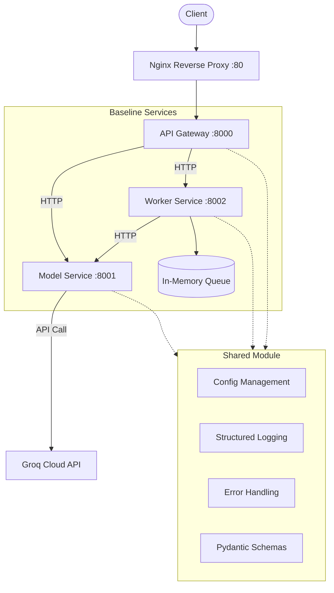

# Prodigon - Learn Production AI System Design

A multi-service AI assistant platform built for teaching production system design patterns, scalability, and security.

## Architecture



## Request Flow

1. **Client** sends `POST /api/v1/generate` to the **API Gateway**
2. **API Gateway** adds request ID, logs the request, and proxies to **Model Service**
3. **Model Service** calls **Groq API** for inference and returns the response
4. **API Gateway** returns the result to the client

For async jobs:
1. Client sends `POST /api/v1/jobs` to the **API Gateway**
2. Gateway forwards to **Worker Service**, which enqueues the job
3. Background worker picks up the job, calls **Model Service**, stores the result
4. Client polls `GET /api/v1/jobs/{id}` for status and results

## Quick Start

```bash
# 1. Clone and setup
bash scripts/setup.sh

# 2. Add your Groq API key to .env
#    Or set USE_MOCK=true for offline mode

# 3. Run all services
make run

# 4. Test it
curl http://localhost:8000/health
curl -X POST http://localhost:8000/api/v1/generate \
  -H "Content-Type: application/json" \
  -d '{"prompt": "Explain microservices in one sentence"}'
```

### With Docker

```bash
make run-docker
```

## Project Structure

```
prod-ai-system-design/
├── baseline/                    # Production codebase
│   ├── api_gateway/            # Public-facing entry point
│   ├── model_service/          # LLM inference via Groq
│   ├── worker_service/         # Async job processing
│   ├── shared/                 # Common utilities
│   ├── infra/                  # Nginx config
│   ├── protos/                 # gRPC definitions
│   ├── tests/                  # Integration tests
│   └── docker-compose.yml
├── workshop/                    # Teaching materials
│   ├── part1_design_patterns/  # Tasks 1-4
│   ├── part2_scalability/      # Tasks 5-8
│   └── part3_security/         # Tasks 9-11
├── scripts/                     # Setup & run scripts
├── .env.example
├── Makefile
└── pyproject.toml
```

## Workshop Topics

| Part | Task | Topic |
|------|------|-------|
| I | 1 | REST APIs vs gRPC |
| I | 2 | Microservices vs Monolith |
| I | 3 | Batch vs Real-time vs Streaming |
| I | 4 | FastAPI Dependency Injection |
| II | 5 | Code Profiling & Optimization |
| II | 6 | Concurrency & Parallelism |
| II | 7 | Memory Management |
| II | 8 | Load Balancing & Caching |
| III | 9 | Authentication vs Authorization |
| III | 10 | Securing API Endpoints |
| III | 11 | Secrets Management |

## Commands

```bash
make help       # Show all commands
make setup      # Install dependencies
make run        # Run all services locally
make run-docker # Run with Docker Compose
make test       # Run tests
make health     # Check service health
make lint       # Run linter
```

## Tech Stack

- **Python 3.11+** with **FastAPI**
- **Groq API** (llama-3.3-70b-versatile) for LLM inference
- **structlog** for structured JSON logging
- **Pydantic v2** for config and validation
- **httpx** for async HTTP
- **Docker** + **docker-compose** for containerization
- **Nginx** as reverse proxy
