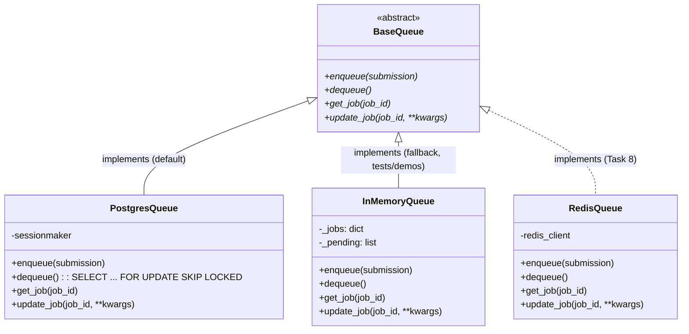

<!-- Version: v1 | Last updated: 2026-04-23 | Status: current -->

# Design Decisions — Architecture Decision Records (ADRs)

These ADRs document the key architectural choices made for the Prodigon platform. Each follows the format: Context, Decision, Alternatives Considered, Consequences. These serve as institutional memory for why things are built this way.

---

## ADR-001: Zustand over Redux/Context for Frontend State

**Context:** The React SPA needs state management for chat sessions (with streaming token updates), settings, health status, and batch jobs. Chat streaming requires high-frequency updates (every token appended to a message).

**Decision:** Zustand 4.5 with 4 independent stores (chat, settings, health, jobs). No middleware, no persistence layer (theme uses manual localStorage).

**Alternatives Considered:**

- **Redux Toolkit** — too much boilerplate (slices, reducers, actions) for this scale; overkill for 4 simple stores.
- **React Context + useReducer** — re-render performance issues with streaming; Context triggers re-renders on ALL consumers, whereas Zustand allows granular subscriptions.
- **Jotai / Recoil** — atom-based models work well but are less familiar to workshop participants.

**Consequences:**

- Minimal boilerplate (each store is ~50 lines).
- No providers needed (stores are module-level singletons).
- `appendToMessage(token)` called per-token during streaming works efficiently because Zustand only re-renders components that read the specific message being updated.
- Trade-off: no Redux DevTools out of the box (Zustand has its own devtools middleware if needed).

---

## ADR-002: Groq API over Local Model Inference

**Context:** The platform needs LLM inference for text generation. Workshop participants need a working system without requiring GPUs or large model downloads.

**Decision:** Groq Cloud API with `llama-3.3-70b-versatile` as default model and `llama-3.1-8b-instant` as fallback. `MockGroqClient` for offline/testing via `USE_MOCK=true`.

**Alternatives Considered:**

- **Local Ollama** — requires GPU or large RAM, model downloads (7GB+), significant setup friction for workshops.
- **OpenAI API** — cost per token, may not be free for all participants.
- **HuggingFace Inference API** — free tier has aggressive rate limits.
- **vLLM / TGI local** — requires NVIDIA GPU, complex setup.

**Consequences:**

- Fast inference (Groq's LPU delivers low latency).
- Free tier available (sufficient for workshop usage).
- No GPU or model download required.
- `MockGroqClient` enables fully offline development and deterministic testing.
- Trade-off: depends on external service availability; mock client mitigates this.

---

## ADR-003: Postgres `SELECT ... FOR UPDATE SKIP LOCKED` over In-Memory / Redis

**Context:** The Worker Service needs a job queue for batch inference. Two hard requirements: (1) jobs must survive a worker restart — the v0 in-memory queue silently dropped everything on every `docker stop`; (2) multiple worker processes must be able to dequeue concurrently without double-processing a job. The system already runs Postgres for chat state, so we have durable storage on hand.

**Decision:** A `batch_jobs` table in Postgres, dequeued via `SELECT ... FOR UPDATE SKIP LOCKED LIMIT 1` inside a transaction that flips the selected row's `status` from `PENDING` to `RUNNING` before committing. `PostgresQueue` (in `baseline/worker_service/app/services/queue.py`) is the default implementation; `InMemoryQueue` is kept as a `QUEUE_TYPE=memory` escape hatch for unit tests and no-DB demos.

**How SKIP LOCKED works here:** each worker runs the same query; Postgres only considers rows not currently locked by another transaction. The first worker to reach a given pending row locks it and claims it; any concurrent worker running the same query silently skips past the locked row and grabs the next one. No retries, no contention storms, no distributed-lock library needed.

**Alternatives Considered:**

- **In-memory `asyncio.Queue` / dict** (v0) — zero dependencies but loses every pending job on restart, and scales only within a single worker process. Unusable once more than one worker replica is running.
- **Redis with rq / arq** — purpose-built for queues, but adds a second stateful system we'd have to operate and keep in sync with the Postgres job-state table. Since job *state* (status, progress, results) already has to live in Postgres, Redis would be a second source of truth that needs reconciling.
- **Celery** — powerful and battle-tested, but a broker + result backend + worker-process management stack is wildly out of proportion to "dequeue a few dozen prompts per day" for a teaching codebase.
- **Postgres `LISTEN / NOTIFY`** — real-time but not durable across worker downtime; jobs enqueued while a worker is offline are missed. SKIP LOCKED polling is simpler and strictly more robust.

**Consequences:**

- Durable — jobs survive worker restarts, compose stops, host reboots.
- Multi-worker safe — N replicas can dequeue the same table concurrently with no extra coordination code.
- JSONB columns for `prompts` / `results` / `meta` keep the schema flexible without a migration per schema tweak.
- Zero added ops cost — Postgres is already in the stack for chat state.
- Trade-off: slightly more overhead than an in-memory queue (one TX per dequeue), and polling latency is bounded by the worker's loop interval rather than real-time push. Well within acceptable envelope for baseline throughput.
- Task 8 (Load Balancing & Caching) will introduce Redis for latency-sensitive paths; the `BaseQueue` abstraction means swapping in a `RedisQueue` is still a drop-in change.



---

## ADR-004: SSE over WebSockets for Token Streaming

**Context:** The frontend needs to display LLM-generated tokens in real-time as they are produced. The communication is unidirectional (server to client) during generation.

**Decision:** Server-Sent Events via FastAPI `StreamingResponse` with `text/event-stream` media type. Frontend uses `fetch()` + `ReadableStream` (not `EventSource`).

**Alternatives Considered:**

- **WebSocket** — bidirectional not needed for streaming; adds connection lifecycle complexity (open, close, reconnect); more complex server-side code.
- **HTTP long polling** — wasteful (new connection per poll), high latency for token delivery.
- **Native EventSource API** — only supports GET requests; our streaming endpoint requires a POST body with GenerateRequest.

**Consequences:**

- Simple unidirectional stream fits the use case exactly.
- Works through nginx with `proxy_buffering off` and `proxy_http_version 1.1`.
- `fetch` + `ReadableStream` gives full control over request method (POST), headers, and body.
- SSE format (`data: token\n\n`) is simple to parse and generate.
- Trade-off: no bidirectional communication; if needed later (e.g., cancel mid-stream), use AbortController on client side (already implemented).

---

## ADR-005: HTTP Service-to-Service over Direct Python Imports

**Context:** The API Gateway needs to call Model Service and Worker Service. Worker Service needs to call Model Service. All are Python FastAPI services in the same repo.

**Decision:** HTTP calls via `ServiceClient` (httpx.AsyncClient wrapper). Each service runs as an independent uvicorn process.

**Alternatives Considered:**

- **Direct Python imports** — breaks service boundaries, couples deployments, cannot scale independently, undermines the microservices teaching goal.
- **gRPC** — scaffolded in `baseline/protos/` but not implemented; adds protobuf compilation step and complexity. Workshop Task 1 teaches this comparison.
- **Message queue (RabbitMQ/Kafka)** — async communication adds complexity; sync HTTP sufficient for current request-response patterns.

**Consequences:**

- Services are independently deployable and scalable.
- Clear network boundary enforces API contracts.
- `ServiceClient` centralizes timeout/retry/error handling.
- Trade-off: adds network latency vs. direct function call; acceptable for teaching and realistic for production.
- Docker Compose uses DNS names (`http://model-service:8001`) for service discovery.

---

## ADR-006: Pydantic Settings for Configuration Management

**Context:** 3 backend services + shared module all need configuration from environment variables with validation and type safety.

**Decision:** `pydantic-settings` with inheritance. `BaseServiceSettings` defines common fields (service_name, environment, log_level, use_mock). Each service extends with its own fields.

**Alternatives Considered:**

- **python-dotenv + os.environ** — no type validation, no defaults, no documentation of expected vars.
- **Dynaconf** — powerful but heavier dependency; settings layering is overkill here.
- **Custom config class** — reinventing the wheel; pydantic-settings is the standard.

**Consequences:**

- Type validation at startup (bad env vars fail fast with clear errors).
- 12-factor app compliant (all config from environment).
- Inheritance reduces duplication (shared fields in base).
- `env_file = "../../.env"` reads from project root.
- Workshop Task 11 evolves this pattern toward secrets management.
- Trade-off: pydantic-settings adds a dependency; but pydantic is already required for FastAPI.

---

## ADR-007: Monorepo with Shared Module over Separate Repos

**Context:** The system has 3 backend services, a frontend, and workshop materials. Code needs to be shared (schemas, errors, logging, config base).

**Decision:** Single repository with `baseline/shared/` module imported by all services. `pyproject.toml` at root manages the Python project.

**Alternatives Considered:**

- **Separate repos per service** — complex for a teaching project; cross-repo changes (schema updates) require coordinated PRs; participants need to clone multiple repos.
- **Git submodules** — adds git complexity; submodule state management is error-prone.
- **Published shared package (PyPI/private)** — publishing overhead; version pinning complexity.

**Consequences:**

- Shared schemas (GenerateRequest, JobResponse, etc.) prevent drift between services.
- Single `pip install -e ".[dev]"` installs everything.
- Single git clone for participants.
- Trade-off: all services share the same Python environment locally (no per-service venvs); Docker provides proper isolation.
- `[tool.setuptools.packages.find] where = ["baseline"]` scopes package discovery to avoid including `frontend/` and `workshop/`.

---

## ADR-008: FastAPI Dependency Injection via Module Globals

**Context:** Route handlers need expensive objects: HTTP clients (ServiceClient), ModelManager, Queue instances. These should be created once at startup, not per-request.

**Decision:** Module-level globals in `dependencies.py`, initialized during FastAPI `lifespan`, accessed via getter functions used with `Depends()`.

Pattern:

```python
_model_client: ServiceClient | None = None

def init_dependencies(settings):
    global _model_client
    _model_client = ServiceClient(settings.model_service_url)

def get_model_client() -> ServiceClient:
    assert _model_client is not None
    return _model_client
```

**Alternatives Considered:**

- **app.state** — works but less discoverable; no IDE autocomplete on `request.app.state.client`.
- **dependency-injector library** — powerful container-based DI; adds significant complexity for a teaching codebase.
- **Creating instances per-request** — wasteful for HTTP clients (connection pooling lost); ModelManager holds state.

**Consequences:**

- Simple and explicit.
- Testable (can call `init_dependencies` with mock settings in tests).
- IDE support (type hints on getter functions).
- `Depends(get_model_client)` clearly documents what each route needs.
- Workshop Task 4 deepens understanding of this pattern.
- Trade-off: module globals are not ideal for multi-process deployments (each worker gets its own copy); acceptable for uvicorn single-process.

---

## ADR-009: Postgres over SQLite / Redis for Persistence

**Context:** v1 adds durable storage for chat sessions, messages, users, and batch jobs. The chosen database has to satisfy three constraints: (1) match the production deployment target (not pretend we'll stay on SQLite forever), (2) support multi-process concurrent writers — specifically the `SKIP LOCKED` semantics the worker queue depends on, (3) handle the semi-structured `prompts` / `results` / `meta` columns without a migration per shape tweak.

**Decision:** Postgres 16 as the sole baseline database. One shared schema across gateway and worker; no sharding, no read-replicas yet.

**Alternatives Considered:**

- **SQLite** — perfect for single-process local dev, but file-locking semantics don't support concurrent writers the way multi-worker deployment needs, and SKIP LOCKED isn't available at all. Would force a dev-vs-prod split we'd rather avoid.
- **Redis as the system of record** — fast but not durable by default (AOF is opt-in and still a weaker guarantee than Postgres WAL); JSON-ish data models exist but are clunky compared to JSONB; lacks relational integrity (FK cascade, transactions across tables).
- **MongoDB / DynamoDB** — document stores solve the JSONB use case, but introduce a query language divergence and a second mental model for data that's fundamentally relational (users → sessions → messages).

**Consequences:**

- One system to learn, operate, and back up.
- `JSONB` gives us schemaless payloads (`prompts`, `results`, `meta`) with full index-ability when we need it.
- `SKIP LOCKED` semantics unlock the Postgres-backed worker queue (ADR-003) without a second broker.
- Matches common production deployment targets (RDS, Cloud SQL, etc.) — no surprises on promotion.
- Trade-off: Postgres is heavier than SQLite for first-time contributors; we mitigate with `make db-up` (Docker) and `make db-up-native` (platform installer) as one-liner paths.

---

## ADR-010: Async SQLAlchemy 2.x + asyncpg

**Context:** Our services are FastAPI / uvicorn, so every route handler runs on the asyncio event loop. A blocking database driver inside an async handler would stall the whole process during every DB call — which would be catastrophic under any meaningful load, and would also serialise the streaming inference endpoints we already ship. We need a truly async Postgres driver.

**Decision:** SQLAlchemy 2.x native async (`AsyncEngine`, `AsyncSession`, `async_sessionmaker`) over the `asyncpg` driver. `expire_on_commit=False` on the session factory, `pool_pre_ping=True` on the engine. FastAPI dependency `get_session` yields an `AsyncSession` per request.

**Alternatives Considered:**

- **psycopg2 / psycopg3 sync + `run_in_executor`** — works but every DB call pays a thread-hop and ties up an executor worker; loses async's whole point.
- **asyncpg directly, no ORM** — fastest on the wire, but we'd be hand-rolling the mapping between rows and Pydantic schemas. Teaching clarity suffers.
- **Tortoise ORM / SQLModel** — both async-first, but SQLAlchemy 2.x is the industry standard; participants who learn it here carry the skill everywhere.

**Consequences:**

- No blocking I/O on the event loop; streaming endpoints and DB-heavy endpoints coexist cleanly.
- `expire_on_commit=False` means ORM objects stay usable after commit without a lazy-load round-trip — critical in async code where lazy loads would need `await`.
- `pool_pre_ping=True` survives DB restarts: a stale socket is detected and retried instead of surfacing as a request error.
- Dependency injection stays idiomatic FastAPI — `session: AsyncSession = Depends(get_session)` in route handlers.
- Trade-off: the async-ORM surface is less mature than sync SQLAlchemy — some patterns (eager loading via `selectinload`, session lifecycle) require more care. We bound the blast radius by keeping DB access behind a thin `ChatRepository` service.

---

## ADR-011: Server as Source of Truth for Chat State

**Context:** The v0 frontend persisted chat sessions to `localStorage`. That was fine for a local demo, but meant clearing browser storage nuked history, switching devices started from scratch, and "my chat disappeared when I cleared cookies" was a real support pattern. With Postgres on the stack, we had the option to make the server authoritative.

**Decision:** Chat sessions and messages live in Postgres. The frontend `chat-store` (`frontend/src/stores/chat-store.ts`) is now a **cache** of server state, not the source of truth. On app mount, `hydrate()` pulls the session list; the active session's messages are lazy-loaded when it's first selected. Every mutation (create, rename, delete, append message) persists through the `/api/v1/chat/*` API.

**Alternatives Considered:**

- **Keep localStorage as the primary store** — simplest path, but locks out cross-device use and leaves history vulnerable to a storage-quota wipe.
- **localStorage + background sync** — two sources of truth, all the merge-conflict fun, and a "which wins" question on every reload. Not worth the complexity for a teaching codebase.
- **IndexedDB** — larger capacity than localStorage but doesn't solve the cross-device problem and adds an async API for marginal gain.

**Consequences:**

- Chat history survives refresh, tab close, browser switch, device switch.
- Clearing localStorage no longer destroys history — only user-scoped UI preferences (`prodigon-onboarded`, `prodigon-topics-panel`, `prodigon-settings`, `prodigon-read-history`) live there now.
- One hydrate round-trip on every app mount; mitigated by the sessions-list endpoint returning summary-only payloads (message bodies are fetched lazily).
- Trade-off: offline-first is gone. The app now assumes a reachable gateway. Given that every useful action also requires the gateway (inference, etc.), this is not a real regression.
- Once Part III's auth lands, chat is already per-user-scoped on the server (see ADR-011 note in CHANGELOG) — flipping from the default seeded user to a real authenticated one is a one-line change in `baseline/api_gateway/app/routes/chat.py::_repo`.

---

## ADR-012: Client-Side Temp IDs Reconciled After POST

**Context:** Streaming assistant turns need a stable id **before** any server round-trip completes — the frontend has to start appending tokens to a message as soon as the first SSE chunk arrives. Waiting for `POST /sessions/{id}/messages` to return a server UUID before showing anything would blow the "feels instant" bar the streaming UX exists to hit. Optimistic user turns have the same problem (press Enter, see your message immediately) on a smaller scale.

**Decision:** Both user and assistant messages get a client-minted `tmp-<nanoid>` id up front. The message is added to the Zustand store and rendered immediately. When the server POST completes, the store swaps the temp id for the real server UUID (`persistUserMessage` for user turns, `persistAssistantMessage` on `onDone` for assistant turns). Rendering components key off the id, so the swap is transparent to React.

**Alternatives Considered:**

- **Block the UI on the POST** — destroys the streaming UX. Non-starter.
- **Use a client-generated UUID as the permanent id** — possible, but ids you didn't mint yourself are a support hazard. Server-generated UUIDs also let the database assign creation order and timestamps authoritatively.
- **Don't persist streamed assistant turns at all until `onDone`** — what we settled on for the POST itself, but the in-flight state still needs an id to key React off of.

**Consequences:**

- Zero perceived latency between keystroke and on-screen message.
- Mid-stream refresh deliberately loses the in-flight assistant turn — half-rendered markdown / truncated code blocks are worse UX than a silent drop, and the user still has the prompt to retry.
- Failed assistant streams are intentionally **not** persisted; a retry leaves no ghost row behind.
- Trade-off: the store transiently holds a temp id that doesn't exist on the server. Any code that tries to PATCH / DELETE on that id before reconciliation would 404 — we guard by only exposing destructive actions once the message has a server id.

---

## ADR-013: Backend-Served Workshop Markdown (vs. Bundled in SPA)

**Context:** The v1 frontend has a Topics Panel and a `/topics/:taskId/:subtopicId` route that renders workshop material (`workshop/**/*.md`). We had two options for where that content lives at runtime.

**Decision:** The gateway serves markdown on demand via `GET /api/v1/workshop/content?path=<relative>.md` (`baseline/api_gateway/app/routes/workshop.py`). The SPA fetches each file lazily when the user navigates to its content page. Path-traversal guards live server-side.

**Alternatives Considered:**

- **Bundle the markdown into the SPA build** — ship content as a big JSON blob or `import.meta.glob('workshop/**/*.md')`. Zero server round-trip, but every content edit requires a frontend rebuild, and the bundle balloons as Parts II/III land.
- **Serve as static files via nginx** — cheapest from a server perspective, but then path-traversal guarding is a nginx config problem, and CORS/auth coupling later gets awkward. Keeping it in the gateway means the same middleware stack (logging, rate limiting, future auth) applies uniformly.
- **Dedicated CMS / headless content service** — wildly out of scope for a teaching codebase.

**Consequences:**

- Workshop content is editable without a frontend rebuild — landing a `README.md` change and restarting the gateway is enough.
- SPA bundle stays small; only the currently-viewed markdown is over the wire.
- Path-traversal defense is server-side, where it belongs — `path` is rejected if it contains `..`, is absolute, or doesn't end in `.md`; the post-`resolve()` path must still be inside `_WORKSHOP_ROOT` via `Path.relative_to()`.
- Trade-off: an extra network round-trip per content view. Mitigated by Skeleton placeholders during load and by browser caching (`ETag` / `Last-Modified` are emitted by FastAPI's static-style response).

---

## ADR-014: Toast Notifications as a Zustand Store + `useToast` Hook

**Context:** Lots of components need to fire transient notifications — code-block copy (`"Copied to clipboard"`), chat export, job complete / failed, "Chat About This", "Mark as Read". Prop-drilling a toast context through every intermediate component is a non-starter; so is making every component import React context.

**Decision:** Toasts live in a dedicated Zustand store (`frontend/src/stores/toast-store.ts`). A single `<ToastContainer />` mounted at the app root subscribes. Any component fires a toast by calling `useToast().success(...)` / `.error(...)` / `.info(...)` / `.warning(...)`, which is a thin typed wrapper around `useToastStore.getState().addToast(...)`. Max 3 visible at once — adding a fourth drops the oldest.

**Alternatives Considered:**

- **react-hot-toast / sonner / react-toastify** — well-maintained libraries, but adding a dep for something this small is overkill, and we already have Zustand as a dependency.
- **React Context + useReducer** — re-renders everything under the provider on every toast change; we hit this same pattern for chat state and concluded Zustand was the right answer (ADR-001). No reason to regress here.
- **A global event bus / window.postMessage** — works but defeats type safety; TS autocomplete over the store API is valuable.

**Consequences:**

- Fire-and-forget from any component: `toast.success('Copied')`. No prop-drilling, no context.
- Max-3 cap means stacking toasts can't crowd out the UI (common failure mode with unbounded toast queues).
- One container, one subscription, minimal re-render surface.
- Trade-off: no built-in animation orchestration (enter/exit choreography) — we hand-roll it with Tailwind keyframes (`animate-slide-up`).

---

## ADR-015: Client-Side Read History in localStorage

**Context:** The Topics Panel shows per-Part progress badges (`X/Y read`), and the ContentViewer auto-marks a topic as read when the user scrolls to the bottom (via IntersectionObserver). We needed a place to persist "which subtopics this user has read".

**Decision:** `prodigon-read-history` in localStorage, managed by `frontend/src/stores/topics-store.ts`. A simple array of subtopic keys; `markAsRead(key)` appends, `isRead(key)` checks membership, `getReadCountForPart(partId)` tallies.

**Alternatives Considered:**

- **Server-side `user_read_history` table** — the correct answer for a shipping product with real user accounts. But (a) we don't have auth yet, so we'd be keying off the seeded default user and effectively having one global read list, (b) every Mark-as-Read would be a network round-trip, and (c) it's one more table to migrate / back up / teach.
- **IndexedDB** — overkill for a flat list of strings.
- **Cookies** — limited size, sent on every request, unnecessary given localStorage works fine.

**Consequences:**

- Zero backend work; ships alongside the frontend v2 landing with no migration.
- Progress is personal, per-device, and low-stakes — exactly the category where per-device persistence is acceptable for a teaching platform.
- Trade-off: clearing localStorage or switching devices resets progress. Accepted; when Part III auth lands, this can migrate to a `user_read_history` table transparently (the store API — `markAsRead`, `isRead`, `getReadCountForPart` — doesn't have to change).

---

## ADR-016: Three-Panel Layout with Toggleable Topics Panel

**Context:** v1 adds a workshop content browser alongside the existing chat experience. The question was where to put it: a separate route that replaces the chat UI, a modal overlay on top of chat, or a persistent panel alongside chat. Users jump between "chat with the model" and "reference workshop material" constantly; any layout that forces them to leave the chat view to consult docs is hostile to that workflow.

**Decision:** Three-panel shell in `frontend/src/components/layout/app-shell.tsx` — left Sidebar (sessions + nav, `w-64`) / center Main (chat or topic content, `flex-1`) / right Topics Panel (`w-80`, toggleable via `useSettingsStore.topicsPanelOpen`). Desktop: right panel collapses to zero width when closed. Mobile (<1024px): right panel renders as an overlay with a backdrop and auto-closes on route change.

**Alternatives Considered:**

- **Topics on the left instead of the right** — would have disrupted existing sidebar muscle-memory for returning users. Right-side workshop content also mirrors the "primary nav left, supplementary content right" convention most devs already know from IDE layouts.
- **Always-on Topics Panel (no toggle)** — steals 320px of horizontal space whether you want it or not. Narrow laptops would lose chat real estate continuously.
- **Modal overlay instead of a panel** — forces a modal dismiss every time you want to look at your chat while reading workshop material. Breaks the side-by-side reference workflow.
- **Separate /topics route that replaces the main view** — we still have this for dedicated browsing (`/topics`, `/topics/:taskId`, `/topics/:taskId/:subtopicId`), but for in-flow consultation the panel wins.

**Consequences:**

- Content-first default — the panel is closed on first load; first-time users see the chat UI and the onboarding banner gets them to try the panel explicitly.
- Toggleable via the header book icon (keyboard: `Cmd+Shift+T`), with `aria-pressed` bound to state.
- `topicsPanelOpen` persisted via `settings-store` (`prodigon-topics-panel` in localStorage) so the choice sticks across reloads.
- Mobile collapse to modal overlay preserves the experience on narrow viewports without a separate mobile layout.
- Trade-off: three-panel layouts are more complex to make accessible — we added `role="complementary"` + `aria-label` on the TopicsPanel, focus-visible rings, and skip-nav. The accessibility work was substantial enough to justify in its own right.

---

## Cross-References

- [Backend Architecture](backend-architecture.md)
- [Frontend Architecture](frontend-architecture.md)
