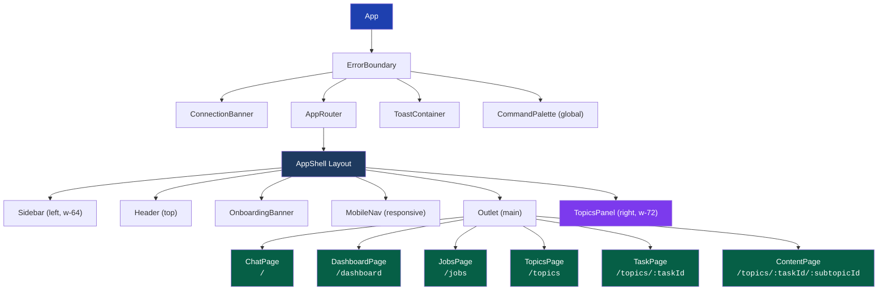
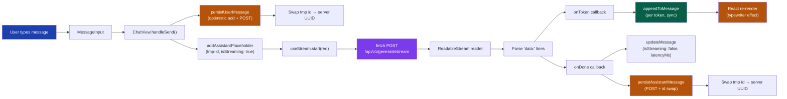
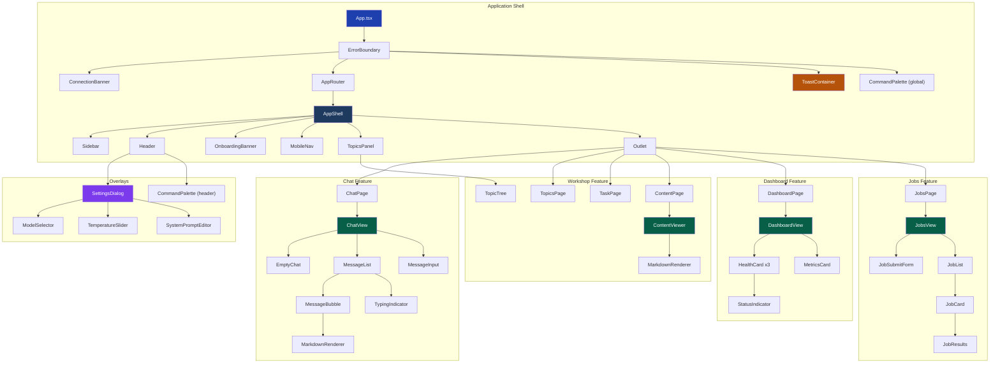
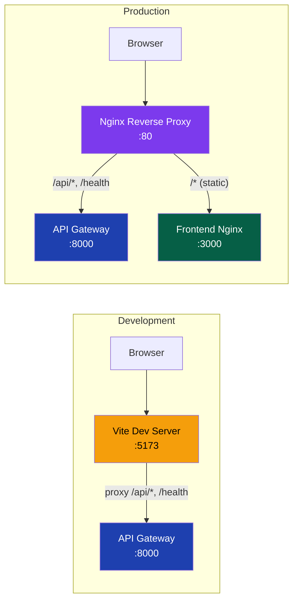

<!-- Version: v1 | Last updated: 2026-04-23 | Status: current -->

# Frontend Architecture Deep Dive -- Prodigon AI Platform React SPA

This document provides a comprehensive architectural reference for the Prodigon AI frontend, a single-page application built with React that serves as the primary user interface for the Prodigon AI platform.

> **v1 note — chat persistence moved server-side.** Chat sessions and messages now live in Postgres, not the browser. The chat store is a cache of server state: it hydrates on mount and survives refresh, tab close, and browser switch. localStorage no longer holds chat history. See `§4.1 chat-store` and `§localStorage Keys` for what does still live client-side.

---

## Table of Contents

1. [Tech Stack](#1-tech-stack)
2. [Project Structure](#2-project-structure)
3. [Routing](#3-routing)
4. [State Management (Zustand)](#4-state-management-zustand)
5. [API Client Layer](#5-api-client-layer)
6. [Streaming Architecture](#6-streaming-architecture)
7. [Component Hierarchy](#7-component-hierarchy)
8. [Styling](#8-styling)
9. [Build and Deployment](#9-build-and-deployment)
10. [Layout — Three-Panel Shell](#10-layout--three-panel-shell)
11. [Workshop Topics Subsystem](#11-workshop-topics-subsystem)
12. [Chat Enhancements](#12-chat-enhancements)
13. [Keyboard Shortcuts](#13-keyboard-shortcuts)
14. [Toast Triggers](#14-toast-triggers)
15. [Accessibility](#15-accessibility)
16. [localStorage Keys](#16-localstorage-keys)
17. [Cross-references](#cross-references)

---

## 1. Tech Stack

| Layer              | Technology                          | Version | Purpose                                      |
|--------------------|-------------------------------------|---------|----------------------------------------------|
| UI Framework       | React                               | 18.3    | Component model, concurrent rendering        |
| Build Tool         | Vite                                | 5.4     | Fast HMR, optimized production builds        |
| Language           | TypeScript                          | 5.5     | Strict mode enabled for type safety          |
| Styling            | Tailwind CSS                        | 3.4     | Utility-first CSS with dark mode support     |
| State Management   | Zustand                             | 4.5     | Lightweight, hook-based global state         |
| Routing            | React Router                        | 6       | Declarative client-side routing              |
| Icons              | Lucide                              | latest  | Consistent, tree-shakable icon set           |
| Markdown           | react-markdown + remark-gfm         | 9       | Renders LLM output and workshop content      |
| Code Highlighting  | react-syntax-highlighter            | latest  | Syntax highlighting inside Markdown blocks   |
| Diagrams           | mermaid                             | 11      | Lazy-loaded Mermaid rendering in markdown    |
| Fonts              | Inter (Google Fonts CDN)            | —       | Primary UI typeface                          |

**Why this stack:**

- **React 18.3** gives us concurrent features (Suspense, transitions) and a mature ecosystem.
- **Vite 5.4** replaces Webpack with near-instant HMR and sub-second cold starts.
- **TypeScript 5.5 strict** catches an entire class of bugs at compile time -- essential for a multi-store, multi-endpoint frontend.
- **Zustand** over Redux: minimal boilerplate, no providers needed, trivial to test. Each store is an independent unit.
- **Tailwind CSS** over CSS-in-JS: zero runtime cost, class-based dark mode toggling, design tokens via CSS custom properties.
- **Inter** over system-font fallback: consistent tabular numerals + ligatures for the chat + topic UI, fetched from the Google Fonts CDN. Strict-egress users fall back to `system-ui` cleanly (see §8 Styling).

---

## 2. Project Structure

```
frontend/src/
├── main.tsx              # BrowserRouter + App mount
├── App.tsx               # ErrorBoundary + ConnectionBanner + AppRouter + ToastContainer
│                         # + chat hydrate() mount-effect + global keyboard shortcuts
├── router.tsx            # Routes: /, /dashboard, /jobs, /topics, /topics/:taskId, /topics/:taskId/:subtopicId
├── index.css             # Tailwind directives, CSS custom properties (incl. --gradient-from/to),
│                         #   .gradient-text, .glass, scrollbar, shimmer, bounce-dot animations
├── api/
│   ├── client.ts         # HttpClient class (fetch wrapper, 30s timeout, error classification;
│   │                     #   get/post/patch/del; parseJson flag for 204 responses)
│   ├── chat.ts           # chatApi (6 methods) + ISO8601↔epoch-ms DTO mappers
│   ├── workshop.ts       # fetchWorkshopContent(path) → markdown
│   ├── endpoints.ts      # api.generate, api.generateStream (AsyncGenerator), api.submitJob, api.getJob, api.health
│   └── types.ts          # TS mirrors of backend Pydantic schemas + custom error classes
├── stores/
│   ├── chat-store.ts     # Cache of server chat state — hydrate + CRUD + streaming placeholder
│   ├── settings-store.ts # Theme, sidebar, topicsPanelOpen, model, temperature, maxTokens, systemPrompt
│   ├── topics-store.ts   # expandedParts + readHistory (localStorage: prodigon-read-history)
│   ├── toast-store.ts    # Toast queue, max 3 visible
│   ├── health-store.ts   # Per-service health status, isConnected flag
│   └── jobs-store.ts     # Batch job list + updates
├── hooks/
│   ├── use-stream.ts           # SSE streaming lifecycle (start/stop via AbortController)
│   ├── use-health-poll.ts      # Polls /health every 15s
│   ├── use-job-poll.ts         # Polls job status every 2s; fires toast on completion/failure
│   ├── use-theme.ts            # Syncs theme to <html class="dark">
│   ├── use-keyboard-shortcuts.ts # Global keydown handler (mod+k, mod+/, etc.)
│   ├── use-auto-scroll.ts      # IntersectionObserver auto-scroll during streaming
│   ├── use-toast.ts            # success/error/info/warning convenience wrappers
│   └── use-command-palette.ts  # Tiny Zustand slice: open, query, setOpen, setQuery
├── components/
│   ├── chat/             # chat-view, message-list, message-bubble, message-input,
│   │                     #   empty-chat, markdown-renderer, typing-indicator
│   ├── dashboard/        # dashboard-view, health-card, metrics-card, status-indicator
│   ├── jobs/             # jobs-view, job-submit-form, job-list, job-card, job-results
│   ├── layout/           # app-shell (three-panel), sidebar, header, mobile-nav
│   ├── topics/           # topics-panel, topic-tree, content-viewer
│   ├── ui/               # toast (+ ToastContainer), command-palette, skeleton, badge
│   ├── settings/         # settings-dialog (focus trap), model-selector, temperature-slider,
│   │                     #   system-prompt-editor
│   └── shared/           # error-boundary (class component), connection-banner, onboarding-banner
├── lib/
│   ├── constants.ts      # API_BASE_URL='', MODELS list, defaults, poll intervals
│   ├── topics-data.ts    # WORKSHOP_TASKS, TASKS_BY_PART, PART_LABELS, getTask, getSubtopic
│   └── utils.ts          # cn() (clsx+twMerge), nanoid(), formatTime(), formatLatency(), truncate()
└── pages/
    ├── chat-page.tsx     # Waits on hydrated before creating a fallback session
    ├── dashboard-page.tsx
    ├── jobs-page.tsx
    ├── topics-page.tsx   # Grid of Part-grouped task cards (/topics)
    ├── task-page.tsx     # 2×2 subtopic grid (/topics/:taskId)
    └── content-page.tsx  # Fetches markdown + IntersectionObserver mark-as-read (/topics/:taskId/:subtopicId)
```

**Architectural rationale:**

- **`api/`** isolates all network concerns. Components never call `fetch` directly. `chat.ts` owns the chat CRUD surface and the ISO 8601 ↔ epoch-ms boundary; `workshop.ts` is a single-function wrapper for workshop content.
- **`stores/`** holds global state. Each store is self-contained with no cross-store subscriptions. The chat store is the only store that is a cache of server-authoritative state; the rest are either client-authoritative (settings, topics) or polling caches (health, jobs).
- **`hooks/`** encapsulates reusable side-effect logic (polling, streaming, DOM observers, keyboard wiring).
- **`components/`** is organized by feature domain, not by component type. `ui/` holds feature-agnostic primitives (Toast, CommandPalette, Skeleton, Badge); `topics/` owns the Workshop Topics surface; `shared/` holds app-wide singletons (ErrorBoundary, ConnectionBanner, OnboardingBanner).
- **`lib/`** holds pure utility functions, constants, and static content trees (`topics-data.ts`).
- **`pages/`** are thin wrappers that compose feature components and connect them to stores.

---

## 3. Routing

Six routes wrapped in a shared `AppShell` layout:

| Route                           | Page Component    | Purpose                                              |
|---------------------------------|-------------------|------------------------------------------------------|
| `/`                             | `ChatPage`        | Interactive chat with streaming inference            |
| `/dashboard`                    | `DashboardPage`   | Service health monitoring and metrics                |
| `/jobs`                         | `JobsPage`        | Batch job submission and status tracking             |
| `/topics`                       | `TopicsPage`      | Workshop task card grid, grouped by Part             |
| `/topics/:taskId`               | `TaskPage`        | 2×2 subtopic grid for a single task                  |
| `/topics/:taskId/:subtopicId`   | `ContentPage`     | Renders markdown fetched from `/api/v1/workshop/...` |

`AppShell` provides the persistent three-panel layout shell: a collapsible **Sidebar** on the left, a **Header** bar at the top, a main content area rendered via React Router's `<Outlet />`, and a toggleable **TopicsPanel** on the right. See §10 Layout for details.

### Route and Layout Diagram



**How it works:**

1. `App.tsx` wraps everything in an `ErrorBoundary` (catches render errors globally) and renders a `ConnectionBanner`, the `AppRouter`, a singleton `ToastContainer`, and a global `CommandPalette` triggered by `mod+k`.
2. `App.tsx` also fires `useChatStore.hydrate()` on mount to pull sessions from the server.
3. `router.tsx` defines all six routes. They are all nested inside `AppShell`, which means the sidebar, header, and topics panel persist across navigation without remounting.
4. `ChatPage` is the index route (`/`). It waits on `hydrated` before deciding whether to create a new session, so hitting `/` before the hydrate round-trip finishes does not spam the API with throwaway "New Chat" rows.

---

## 4. State Management (Zustand)

The frontend uses six independent Zustand stores plus a small command-palette slice hook. Each is created via `create()` and consumed as a React hook. There are no cross-store subscriptions -- stores are fully decoupled.

| Store / Slice          | Source of truth         | Persistence                                            |
|------------------------|-------------------------|--------------------------------------------------------|
| `chat-store`           | **Server (Postgres)**   | None — in-memory cache of server state                 |
| `settings-store`       | Client                  | `prodigon-theme`, `prodigon-topics-panel` (localStorage) |
| `topics-store`         | Client                  | `prodigon-read-history` (localStorage)                 |
| `toast-store`          | Client (ephemeral)      | None                                                   |
| `health-store`         | Server (polled)         | None                                                   |
| `jobs-store`           | Server (polled)         | None                                                   |
| `useCommandPalette`    | Client (ephemeral)      | None                                                   |

### 4.1 chat-store

**The store is now a cache of server state, not the source of truth.** Postgres owns chat sessions and messages; the store mirrors what the server returns and writes back through `chatApi`. On boot, `hydrate()` pulls the session list; messages for a given session are lazy-loaded the first time it becomes active. Streaming assistant turns live locally with a `tmp-` id until `onDone` fires, at which point they are persisted and the temp id is swapped for the server UUID.

**State shape:**

```typescript
interface ChatState {
  sessions: ChatSession[];
  activeSessionId: string | null;
  hydrated: boolean;     // true once the initial listSessions round-trip resolves
  hydrating: boolean;    // guards against duplicate hydrate() calls during mount race

  // Derived helpers
  activeSession: () => ChatSession | undefined;

  // Lifecycle
  hydrate: () => Promise<void>;

  // Sessions (server-persisted)
  createSession: () => Promise<string>;
  setActiveSession: (id: string) => Promise<void>;  // lazy-loads messages on first select
  deleteSession: (id: string) => Promise<void>;     // optimistic
  renameSession: (id: string, title: string) => Promise<void>;  // optimistic

  // Messages
  persistUserMessage: (sessionId: string, content: string) => Promise<string>;  // optimistic + POST + id swap
  addAssistantPlaceholder: (sessionId: string, model?: string) => string;       // sync, returns tmp id
  appendToMessage: (sessionId: string, messageId: string, token: string) => void;  // sync, per streaming token
  updateMessage: (sessionId: string, messageId: string, updates: Partial<ChatMessage>) => void;  // sync
  persistAssistantMessage: (sessionId: string, tempMessageId: string) => Promise<void>;  // POST on onDone + id swap
}
```

**Data types:**

```typescript
interface ChatSession {
  id: string;            // server UUID, or tmp-<nanoid> until persisted
  title: string;         // auto-set from first user message, truncated to 50 chars
  createdAt: number;     // epoch ms (mapped from server ISO 8601)
  updatedAt: number;
  messages: ChatMessage[];
  messagesLoaded: boolean; // list endpoint returns summaries only; detail endpoint populates
  messageCount: number;    // server-reported total (used by sidebar previews while messages=[])
}

interface ChatMessage {
  id: string;            // server UUID, or tmp-<nanoid> during streaming
  role: 'user' | 'assistant';
  content: string;
  timestamp: number;     // epoch ms
  model?: string;
  latencyMs?: number;    // locally-computed on assistant messages
  isStreaming?: boolean; // true while tokens are arriving
  error?: string;
}
```

**Action semantics (async vs sync):**

| Action                      | Kind  | Server I/O                                                   | Failure behaviour                          |
|-----------------------------|-------|--------------------------------------------------------------|--------------------------------------------|
| `hydrate()`                  | async | `GET /sessions` → auto-selects most recent, lazy-loads detail | Logs, marks `hydrated: true`, stays usable  |
| `createSession()`           | async | `POST /sessions`                                              | Throws — caller handles                    |
| `setActiveSession(id)`      | async | `GET /sessions/:id` iff `!messagesLoaded`                     | Logs; active id still set                  |
| `deleteSession(id)`         | async | `DELETE /sessions/:id` after optimistic removal               | Re-inserts from snapshot                   |
| `renameSession(id, title)`  | async | `PATCH /sessions/:id` after optimistic rename                 | Logs; local title stays                    |
| `persistUserMessage(...)`   | async | `POST /sessions/:id/messages` (+ optional title sync)         | Logs; tmp id stays in UI                   |
| `addAssistantPlaceholder`   | sync  | —                                                            | —                                          |
| `appendToMessage`           | sync  | —                                                            | —                                          |
| `updateMessage`             | sync  | —                                                            | —                                          |
| `persistAssistantMessage`   | async | `POST /sessions/:id/messages` on `onDone`                     | Logs; UI keeps the tmp id until next hydrate |

**Why this split:** streaming assistant output fires `appendToMessage(...)` dozens of times per second. Making that sync keeps the hot path free of promise overhead and React batching surprises. Server round-trips only happen on lifecycle edges (send, done, rename, delete), where a 50–200ms latency is invisible relative to a human action.

**Failed assistant streams are deliberately not persisted.** A blank or half-streamed turn isn't useful to save — leaving it client-only means the message disappears on the next hydrate, which is the correct recovery behaviour.

### 4.2 settings-store

Manages user preferences. Theme and topics-panel state are persisted to `localStorage`; other settings are session-scoped.

**State shape:**

```typescript
interface SettingsState {
  theme: 'light' | 'dark' | 'system';
  sidebarOpen: boolean;
  topicsPanelOpen: boolean;              // persisted: prodigon-topics-panel
  model: string;
  temperature: number;
  maxTokens: number;
  systemPrompt: string;
  topicSystemPrompt: string | null;      // set by "Chat About This" — takes priority over systemPrompt

  setTheme: (theme: Theme) => void;
  toggleSidebar: () => void;
  setSidebarOpen: (open: boolean) => void;
  toggleTopicsPanel: () => void;
  setTopicsPanelOpen: (open: boolean) => void;
  setModel: (model: string) => void;
  setTemperature: (temp: number) => void;
  setMaxTokens: (tokens: number) => void;
  setSystemPrompt: (prompt: string) => void;
  setTopicSystemPrompt: (prompt: string | null) => void;
  resetToDefaults: () => void;
}
```

**Persistence strategy:**

- `theme` is stored in `localStorage('prodigon-theme')`. On store init, the theme is read from localStorage and `applyTheme()` toggles the `dark` class on `<html>` to trigger Tailwind's dark mode variants.
- `topicsPanelOpen` is persisted to `localStorage('prodigon-topics-panel')` — the user's last choice sticks across reloads.
- `resetToDefaults()` clears both localStorage keys and resets all values to their compile-time defaults.
- Other settings (model, temperature, system prompt, etc.) are session-scoped — they reset on page refresh. This is intentional: inference parameters should not surprise users with stale values.
- `topicSystemPrompt` is a one-shot prompt set by the ContentViewer's **Chat About This** button. `ChatView.handleSend` consumes and clears it on the first send, so it only affects the first turn of the newly-created session.

### 4.3 topics-store

Tracks which accordion sections are expanded in the TopicTree and which subtopics the user has read.

**State shape:**

```typescript
interface TopicsState {
  expandedParts: string[];    // default ['I']
  readHistory: ReadEntry[];   // persisted: prodigon-read-history

  togglePart: (part: string) => void;
  markAsRead: (taskId: string, subtopicId: string) => void;
  isRead: (taskId: string, subtopicId: string) => boolean;
  getReadCountForPart: (part: string, taskIds: string[]) => number;
}

interface ReadEntry {
  taskId: string;
  subtopicId: string;
  readAt: number;
}
```

**Persistence:** `readHistory` is loaded from `localStorage('prodigon-read-history')` on init and re-saved on every `markAsRead`. Parent-compatible failures (quota exceeded, privacy mode) are swallowed silently.

**Read-marking triggers:** two paths set a subtopic as read — an `IntersectionObserver` in `ContentViewer` that fires when the bottom sentinel scrolls into view (threshold 0.5), and an explicit **Mark as Read** button. Both dedupe on `(taskId, subtopicId)`.

See [ADR-015](design-decisions.md#adr-015) for why read history is client-side.

### 4.4 toast-store

A lightweight notification queue capped at three visible toasts.

**State shape:**

```typescript
interface ToastState {
  toasts: Toast[];
  addToast: (toast: ToastInput) => void;
  removeToast: (id: string) => void;
}

interface Toast {
  id: string;                                     // generated: `toast-<ts>-<rand>`
  type: 'success' | 'error' | 'info' | 'warning';
  title: string;
  message?: string;
  duration: number;                               // default 4000 ms; errors default 6000 via useToast
}
```

**Key behaviour:**

- When `toasts.length >= 3`, the oldest is dropped before the new one is appended — stacks never grow past three.
- `ToastContainer` (`components/ui/toast.tsx`) is rendered once at the app root. Each `ToastItem` owns a `setTimeout` that calls `removeToast(id)` after `duration` ms.
- Components fire toasts through the `useToast()` hook (`hooks/use-toast.ts`), which exposes `success / error / info / warning` wrappers so the call site never has to type the toast shape.

See [ADR-014](design-decisions.md#adr-014) for why this was built in-house rather than pulling in `react-hot-toast`.

### 4.5 useCommandPalette

A minimal Zustand slice (`hooks/use-command-palette.ts`) tracking the palette's open and query state. Currently the `<CommandPalette>` in `App.tsx` and `Header` maintain their own local `useState` for open/close (both render the same `CommandPalette` component); this slice exists for components that need to read or toggle palette state without prop-drilling.

```typescript
interface CommandPaletteState {
  open: boolean;
  query: string;
  setOpen: (open: boolean) => void;  // also resets query
  setQuery: (query: string) => void;
}
```

### 4.6 health-store

Tracks per-service health status for the dashboard. **Tracked services:** `api-gateway`, `model-service`, `worker-service`. The `isConnected` flag is consumed by the `ConnectionBanner` component to show a global "disconnected" warning. Not persisted — health is inherently ephemeral.

### 4.7 jobs-store

Manages batch job state for the jobs page. `addJob()` prepends new jobs (most recent first); `updateJob()` patches a job by ID — used by `useJobPoll` to update status transitions. Not persisted; jobs are server-authoritative and now durable in the `batch_jobs` Postgres table.

---

## 5. API Client Layer

### 5.1 HttpClient (`client.ts`)

A singleton class wrapping the native `fetch` API with production-grade error handling.

**Features:**

- **30-second timeout** via `AbortController` + `setTimeout`. Prevents hung requests from blocking the UI indefinitely.
- **Automatic JSON serialization/deserialization** on request bodies and response payloads.
- **204 No Content handling** via an internal `parseJson` flag so `DELETE` doesn't try to `JSON.parse` an empty body.
- **Error classification** -- converts raw fetch failures into typed error classes:

| Failure Mode          | Error Class        | Trigger                                      |
|-----------------------|--------------------|----------------------------------------------|
| Network unreachable   | `ConnectionError`  | `fetch` throws (DNS failure, offline, CORS)  |
| Request exceeds 30s   | `TimeoutError`     | `AbortController.abort()` fires              |
| HTTP 4xx or 5xx       | `ApiRequestError`  | Response status outside 200-299 range        |

```typescript
class HttpClient {
  async get<T>(path: string): Promise<T>;
  async post<T>(path: string, body: unknown): Promise<T>;
  async patch<T>(path: string, body: unknown): Promise<T>;
  async del(path: string): Promise<void>;  // uses parseJson: false

  private request<T>(path: string, init: RequestInit, opts?: { parseJson?: boolean }): Promise<T>;
}
```

The internal `request` honors `opts.parseJson` and also short-circuits to `undefined as T` on `response.status === 204`, keeping the call-site of `del` simple.

**Why a custom wrapper instead of axios or ky:**

- Zero dependencies -- the native `fetch` API is available in all target browsers.
- Full control over timeout and abort behavior, which is critical for the streaming endpoint.
- The error classification layer is specific to our backend's error response format.

### 5.2 Endpoints

#### Generation, jobs, health (`endpoints.ts`)

| Function              | HTTP Method | Path                       | Returns                  |
|-----------------------|-------------|----------------------------|--------------------------|
| `api.generate(req)`   | POST        | `/api/v1/generate`         | `GenerateResponse`       |
| `api.generateStream(req, signal?)` | POST | `/api/v1/generate/stream` | `AsyncGenerator<string>` |
| `api.submitJob(req)`  | POST        | `/api/v1/jobs`             | `JobResponse`            |
| `api.getJob(jobId)`   | GET         | `/api/v1/jobs/{jobId}`     | `JobResponse`            |
| `api.health()`        | GET         | `/health`                  | `HealthResponse`         |

#### Chat persistence (`chat.ts`)

Typed wrappers around `/api/v1/chat/*`, exported as a single `chatApi` object. All methods return store-shaped data (`ChatSession` / `ChatMessage`); the ISO 8601 → epoch-ms boundary is crossed by the internal mappers so the rest of the app never sees server timestamp strings.

| Function                                  | HTTP Method | Path                                           | Returns          |
|-------------------------------------------|-------------|------------------------------------------------|------------------|
| `chatApi.listSessions()`                  | GET         | `/api/v1/chat/sessions`                        | `ChatSession[]`  |
| `chatApi.getSession(id)`                  | GET         | `/api/v1/chat/sessions/:id`                    | `ChatSession`    |
| `chatApi.createSession(payload?)`         | POST        | `/api/v1/chat/sessions`                        | `ChatSession`    |
| `chatApi.updateSession(id, payload)`      | PATCH       | `/api/v1/chat/sessions/:id`                    | `ChatSession`    |
| `chatApi.deleteSession(id)`               | DELETE      | `/api/v1/chat/sessions/:id`                    | `void` (204)     |
| `chatApi.appendMessage(sessionId, body)`  | POST        | `/api/v1/chat/sessions/:id/messages`           | `ChatMessage`    |

**DTO mappers (ISO 8601 ↔ epoch ms):**

| Mapper                  | Input                        | Output         | Notes                                                           |
|-------------------------|------------------------------|----------------|-----------------------------------------------------------------|
| `mapMessage`            | `ServerChatMessage`          | `ChatMessage`  | `created_at` → `timestamp`; pulls `model` / `latency_ms` from `meta` |
| `mapSessionSummary`     | `ServerChatSession`          | `ChatSession`  | `messages: []`, `messagesLoaded: message_count === 0`            |
| `mapSessionDetail`      | `ServerChatSessionDetail`    | `ChatSession`  | Maps every message, sets `messagesLoaded: true`                  |

`toTimestamp(iso)` falls back to `Date.now()` on `NaN` so a malformed server timestamp never renders as `NaNm ago`.

A single exported helper, `makeTempId()`, generates throwaway client-side ids (`tmp-<nanoid>`) for the streaming assistant placeholder and optimistic user-message add. The server's real UUID replaces the temp id in-place once persistence succeeds.

#### Workshop content (`workshop.ts`)

A single thin wrapper:

```typescript
export async function fetchWorkshopContent(path: string): Promise<string> {
  const data = await client.get<{ content: string; path: string }>(
    `/api/v1/workshop/content?path=${encodeURIComponent(path)}`,
  );
  return data.content;
}
```

`ContentPage` calls this with paths taken from `topics-data.ts` (e.g. `part1_design_patterns/task01_rest_vs_grpc/README.md`). The backend's path-traversal guard is described in [api-reference.md §3.6](api-reference.md).

### 5.3 Streaming Endpoint: `api.generateStream()`

This is the most architecturally significant endpoint. It returns an `AsyncGenerator<string>` that yields individual tokens from the LLM.

**Implementation approach: `fetch` + `ReadableStream` (NOT `EventSource`)**

The SSE endpoint requires a **POST body** containing the `GenerateRequest` payload (prompt, model, temperature, etc.). The native browser `EventSource` API only supports **GET requests** -- it cannot send a request body. Therefore, we use:

1. `fetch()` with method POST to initiate the SSE connection.
2. `response.body.getReader()` to obtain a `ReadableStream` reader.
3. `TextDecoder` to convert raw bytes to UTF-8 strings.
4. Manual parsing of `data:` prefixed lines from the SSE protocol.

**SSE protocol signals:**

| Signal         | Meaning                        | Action                    |
|----------------|--------------------------------|---------------------------|
| `data: <token>`| A token fragment from the LLM  | Yield token to consumer   |
| `data: [DONE]` | Stream completed successfully  | Close the generator       |
| `data: [ERROR]`| Server-side error occurred     | Throw error, close stream |

**Cancellation:** An optional `AbortSignal` parameter allows the caller (via `useStream` hook) to cancel an in-flight stream by aborting the fetch request.

---

## 6. Streaming Architecture

Streaming is the core interactive feature. Here is the complete data flow from user input to rendered token — note the dual optimistic-add + server-persist pattern for both user and assistant turns.



### Detailed Flow

1. **User types a message** in `MessageInput` and presses Enter (or clicks Send).
2. **`ChatView.handleSend()`** orchestrates the send sequence:
   - Calls `chat-store.persistUserMessage(sessionId, prompt)` — this adds the user message with a `tmp-` id **and** fires `POST /api/v1/chat/sessions/:id/messages` in the background. When the POST returns, the temp id is replaced by the server UUID in place.
   - Calls `chat-store.addAssistantPlaceholder(sessionId, model)` which returns a `tmp-` id; this placeholder has `isStreaming: true` and empty content.
   - Calls `useStream.start()` with the request payload, wiring `onToken`, `onDone`, `onError`.
3. **`useStream` hook** manages the streaming lifecycle:
   - Creates a new `AbortController` for cancellation support.
   - Calls `api.generateStream(request, signal)` which returns an `AsyncGenerator<string>`.
   - Iterates the generator in a `for await...of` loop.
   - For each yielded token, invokes the `onToken` callback.
4. **`onToken` callback** calls `chat-store.appendToMessage(sessionId, assistantId, token)` — a sync action that concatenates the token to the assistant message's `content` field.
5. **React re-renders** the `MessageBubble` component for the assistant message, producing the typewriter effect. The `useAutoScroll` hook keeps the message list scrolled to the bottom. A `sr-only` `aria-live="polite"` region in `MessageList` announces "Response loading…" on the first token (see §15 Accessibility).
6. **On `onDone`**, two actions fire in order:
   - `updateMessage(sessionId, assistantId, { isStreaming: false, latencyMs })` — sync, clears the streaming flag and records the wall-clock latency from `performance.now()`.
   - `persistAssistantMessage(sessionId, assistantId)` — POSTs the finalized content + meta (`model`, `latency_ms`) and swaps the temp id for the server UUID.
7. **On `onError`**, `updateMessage(..., { isStreaming: false, error })` marks the placeholder as failed. **No persistence call is made** — a blank or half-streamed turn isn't worth saving; the placeholder will disappear on the next hydrate.
8. **On cancellation** (user clicks Stop), `useStream.stop()` calls `abort()` on the AbortController, which terminates the fetch request and closes the generator.

**Mid-stream refresh semantics:** if the user refreshes the tab while tokens are still arriving, the in-flight assistant turn is lost. The user message persisted on send, so it'll reappear in the rehydrated session; the partially-streamed assistant turn will not, because `persistAssistantMessage` hadn't fired yet. This is intentional — see the top-of-file comment in `frontend/src/stores/chat-store.ts`.

### Performance Considerations

- Each `appendToMessage` call triggers a Zustand state update and a React re-render. For fast token streams (50+ tokens/second), this is acceptable because React 18's automatic batching coalesces rapid state updates into fewer re-renders.
- The `useAutoScroll` hook uses `IntersectionObserver` rather than `scrollIntoView()` on every render, avoiding layout thrashing.
- Keeping the streaming path sync (no `await` per token) avoids promise-microtask overhead that would otherwise compound into noticeable lag at high token rates.

---

## 7. Component Hierarchy



### Component Descriptions

**Layout Components (`components/layout/`):**

- **`AppShell`** -- Persistent three-panel layout: skip-nav link, Sidebar (desktop left), MobileNav (mobile overlay), Header + OnboardingBanner + `<main id="main-content">` with `<Outlet />` and TopicsPanel (right). See §10 Layout.
- **`Sidebar`** -- Left navigation panel, `w-64` when open, `w-0` when collapsed. Session list (live from chat-store, updated on every action), New Chat button, nav links (Chat, Dashboard, Batch Jobs, Workshop), Collapse button. Uses `aria-current="page"` on the active nav link.
- **`Header`** -- Top bar with page title, model selector, Search/Command-Palette trigger (`⌘K` / `Ctrl+K` kbd hint), theme toggle, Settings button, and Topics Panel toggle (`BookOpen` icon, `aria-pressed={topicsPanelOpen}`).
- **`MobileNav`** -- Slide-over sidebar for mobile/tablet viewports (hidden at `md:`). Auto-closes on route change. Same nav links + session list as desktop sidebar.

**Chat Components (`components/chat/`):**

- **`ChatView`** -- Main chat orchestrator. Manages send flow, coordinates `useStream`, renders EmptyChat / MessageList / MessageInput. Owns the **Export** button (top-right, visible when `messages.length > 0`) and the session stats strip (`{count} messages · ~{tokens} tokens · {relativeTime}`) above MessageInput.
- **`MessageList`** -- Renders messages in the active session. Owns the `aria-live="polite"` sr-only region that announces "Response loading…" while any message has `isStreaming: true`.
- **`MessageBubble`** -- A single message. User messages right-aligned with primary background; assistant messages left-aligned and rendered through `MarkdownRenderer`.
- **`MessageInput`** -- Auto-resizing textarea (clamped 1–6 rows via inline style), Send / Stop buttons, Enter-to-send (Shift+Enter for newline). Shows a `~{tokens} tokens` estimate below the input when `value.length > 20`.
- **`EmptyChat`** -- Shown when the active session has no messages. Displays a welcome message and suggested prompts.
- **`MarkdownRenderer`** -- Wraps `react-markdown` with `remark-gfm`, `react-syntax-highlighter` for code blocks, and a lazy-loaded `MermaidBlock` for `\`\`\`mermaid` fences. `CodeBlock.handleCopy` and `PlainBlock.handleCopy` fire `toast.success('Copied to clipboard')` on successful clipboard write. Language aliases (`sh → bash`, `proto → protobuf`, etc.) are normalised before Prism.
- **`TypingIndicator`** -- Animated three-dot indicator shown while the assistant message has `isStreaming: true` and content is empty (before the first token arrives).

**Workshop Components (`components/topics/`):**

- **`TopicsPanel`** -- Right-side workshop browser. Desktop: inline column, `lg:w-72` when open, `lg:w-0` when collapsed; bordered `lg:border-l`. Mobile (`< lg`): slide-in overlay from the right with a backdrop that closes on click, auto-closed on route change (`<1024px` check in a `useEffect`). Both instances carry `role="complementary"` + `aria-label="Workshop topics"`. Renders `<TopicTree />`.
- **`TopicTree`** -- Accordion Part → Task list inside the panel. Part headers are buttons with `aria-expanded`, each showing a `ProgressBar` (read count / total subtopics). Unimplemented tasks render as dimmed rows with a `Lock` icon and a "Soon" badge. Keyboard navigation: ArrowDown/ArrowUp moves focus between rows (via `data-row` attr); ArrowLeft/ArrowRight expand/collapse Parts; Enter navigates to the focused task. Active task carries `aria-current="page"`.
- **`ContentViewer`** -- Displays workshop markdown with breadcrumb (Workshop → Task → Subtopic), `difficulty` badge, **Chat About This** and **Mark as Read** action buttons, the rendered content, and prev / next subtopic navigation. Owns the `sentinelRef` `IntersectionObserver` that auto-marks-as-read when the bottom sentinel enters the viewport (`threshold: 0.5`).

**Dashboard Components (`components/dashboard/`):**

- **`DashboardView`** -- Lays out three `HealthCard` components (one per service) and a `MetricsCard`.
- **`HealthCard`** -- Service health status, response time, last checked timestamp, version, environment. Uses `StatusIndicator` for the colored dot.
- **`MetricsCard`** -- Aggregate metrics (total sessions, total messages, average latency).
- **`StatusIndicator`** -- A small colored circle: green (healthy), yellow (degraded), red (unhealthy), gray (unknown).

**Jobs Components (`components/jobs/`):**

- **`JobsView`** -- Job submission form + job list.
- **`JobSubmitForm`** -- Form fields for batch job parameters. Submits via `api.submitJob()`.
- **`JobList`** -- Renders all jobs from `jobs-store`, newest first.
- **`JobCard`** -- Job ID, status, progress bar (for running jobs), timestamps. Expandable to `JobResults`.
- **`JobResults`** -- Completed job output (generated texts, processing time, token counts).

**Settings Components (`components/settings/`):**

- **`SettingsDialog`** -- Modal dialog opened from the Header. Implements a **focus trap** (Tab / Shift+Tab cycle within the dialog), Escape-to-close, `document.body.style.overflow = 'hidden'` to prevent background scroll, and auto-focuses the first focusable element on open + restores focus to the trigger on close. Carries `role="dialog"` + `aria-modal="true"` + `aria-label="Settings"`.
- **`ModelSelector`** / **`TemperatureSlider`** / **`SystemPromptEditor`** -- Controls for their respective settings-store fields.

**UI primitives (`components/ui/`):**

- **`Toast` + `ToastContainer`** -- Fixed position `bottom-4 right-4` container (`z-[200]`). Each `ToastItem` is color-coded via a left border (green / red / blue / amber) and matching `Lucide` icon (`CheckCircle2 / XCircle / Info / AlertTriangle`). Uses `animate-slide-up` for entrance; auto-dismisses via a per-item `setTimeout(removeToast, duration)`. Each toast carries `role="alert"` + `aria-live="polite"`.
- **`CommandPalette`** -- Cmd+K modal. Fixed `pt-[15vh]` positioned dialog with a blurred backdrop (`bg-black/50 backdrop-blur-sm`). Three result groups: **Actions** (New Chat, Go to Dashboard/Batch Jobs, toggle theme), **Workshop Topics** (only `implemented` tasks from `WORKSHOP_TASKS`), **Recent Sessions** (`sessions.slice(0, 5)`). Keyboard: ArrowUp/ArrowDown moves `focusedIdx`, Enter fires the action, Escape closes. The input auto-focuses on open; focused rows scroll into view. Carries `role="dialog"` + `aria-modal="true"` + `role="listbox"` on the result container with `aria-live="polite"`.
- **`Skeleton`** -- Shimmer loading placeholder. Uses a `::before` pseudo-element with a translucent gradient driven by `animate-shimmer`. Used by `ContentViewer`'s `LoadingSkeleton` block while markdown fetches.
- **`Badge`** -- Reusable status/label chip with five variants: `default / secondary / success / warning / coming-soon`.

**Shared Components (`components/shared/`):**

- **`ErrorBoundary`** -- React class component. Catches unhandled render errors and shows a fallback with a Reload button.
- **`ConnectionBanner`** -- Fixed-position banner shown when `health-store.isConnected` is `false`.
- **`OnboardingBanner`** -- First-visit welcome strip rendered inside `AppShell`, below the Header. Visible only when `localStorage('prodigon-onboarded') !== 'true'`. Two actions: "Open Topics Panel →" (opens the panel and marks onboarded) and a dismiss `X` (marks onboarded without opening).

---

## 8. Styling

### Design System

The frontend uses **Tailwind CSS 3.4** with a custom design token system built on CSS custom properties.

**Dark mode strategy:** Class-based dark mode (`darkMode: 'class'` in Tailwind config). The `<html>` element receives a `dark` class, which activates Tailwind's `dark:` variants. This is toggled by the `useTheme` hook based on the `settings-store.theme` value.

### Color Tokens

HSL-based design tokens are defined as CSS custom properties in `index.css`:

```css
:root {
  --background: 0 0% 100%;
  --foreground: 240 10% 3.9%;
  --card: 0 0% 100%;
  --card-foreground: 240 10% 3.9%;
  --primary: 239 84% 67%;
  --primary-foreground: 0 0% 98%;
  --secondary: 240 4.8% 95.9%;
  --muted: 240 4.8% 95.9%;
  --muted-foreground: 240 3.8% 46.1%;
  --destructive: 0 84.2% 60.2%;
  --border: 240 5.9% 90%;
  --ring: 239 84% 67%;
  --radius: 0.5rem;
  /* Brand gradient */
  --gradient-from: 239 84% 67%;
  --gradient-to: 271 81% 66%;
}

.dark {
  --background: 240 10% 3.9%;
  --foreground: 0 0% 98%;
  --primary: 239 84% 67%;
  /* ... dark overrides ... */
}
```

This approach allows the entire color scheme to change by toggling the `.dark` class, without rewriting any component styles.

### Typography: Inter

`index.html` preconnects to Google Fonts and pulls Inter (weights 400/500/600/700):

```html
<link rel="preconnect" href="https://fonts.googleapis.com">
<link rel="preconnect" href="https://fonts.gstatic.com" crossorigin>
<link href="https://fonts.googleapis.com/css2?family=Inter:wght@400;500;600;700&display=swap" rel="stylesheet">
```

`src/index.css` applies it globally with a sensible fallback:

```css
body {
  @apply bg-background text-foreground;
  font-family: 'Inter', system-ui, sans-serif;
  font-feature-settings: "rlig" 1, "calt" 1;
}
```

Users on networks that block the Google Fonts CDN fall back to `system-ui` without any broken layout — no vendoring needed.

### Utility Classes

- **`.gradient-text`** -- `linear-gradient(135deg, hsl(var(--gradient-from)), hsl(var(--gradient-to)))` with `-webkit-background-clip: text` for the brand wordmark (Sidebar + MobileNav header).
- **`.glass`** -- Translucent `hsl(240 10% 10% / 0.7)` fill with `backdrop-filter: blur(12px)` and a subtle border — used for overlays that need to remain legible over busy content.

### Animations

Custom keyframes live in `tailwind.config.ts` and are exposed as Tailwind `animate-*` classes:

| Class                | Keyframe    | Duration / Easing                | Used by                                         |
|----------------------|-------------|----------------------------------|-------------------------------------------------|
| `animate-bounce-dot` | `bounce-dot`| `1.4s infinite ease-in-out both` | TypingIndicator (three-dot sequence)            |
| `animate-slide-up`   | `slide-up`  | `0.2s ease-out`                  | Toast entrance (`ToastItem`)                    |
| `animate-shimmer`    | `shimmer`   | `1.4s ease-in-out infinite`      | `Skeleton` loading placeholder                  |
| `animate-scale-in`   | `scale-in`  | `0.15s ease-out`                 | CommandPalette panel, modal entrances           |
| `animate-fade-in`    | `fade-in`   | `0.2s ease-out`                  | Generic fade-in for conditional elements        |

In addition, `index.css` defines a dedicated `::before` implementation of the shimmer effect on elements that carry `.animate-shimmer` directly (used inside `Skeleton`), plus a custom thinner scrollbar (`::-webkit-scrollbar`) for the chat message list and topic tree.

### Utility: `cn()`

```typescript
import { clsx, type ClassValue } from 'clsx';
import { twMerge } from 'tailwind-merge';

export function cn(...inputs: ClassValue[]) {
  return twMerge(clsx(inputs));
}
```

This utility merges Tailwind classes intelligently. When two conflicting classes are passed (e.g., `p-4` and `p-2`), `tailwind-merge` resolves the conflict by keeping only the last one, preventing broken layouts from class duplication.

---

## 9. Build and Deployment

### 9.1 Development

```bash
cd frontend
npm install
npm run dev
```

- Vite starts a dev server on **port 5173** with Hot Module Replacement (HMR).
- The Vite config includes a **proxy** that forwards `/api/*` and `/health` requests to `http://localhost:8000` (the API Gateway). This eliminates CORS issues during local development.
- `API_BASE_URL` is set to `''` (empty string) in constants, so all API calls use relative URLs that work transparently with the proxy.

**App boot sequence (first paint in dev and prod):**

1. `main.tsx` mounts `<App />` inside a `BrowserRouter`.
2. `App.tsx` fires a `useEffect(() => hydrate(), [hydrate])` on mount — this calls `useChatStore.getState().hydrate()` once. The store guards against duplicate calls via `hydrated` / `hydrating` flags, so React StrictMode's double-invoke is safe.
3. `hydrate()` calls `GET /api/v1/chat/sessions`, populates the store, and auto-selects the most recent session (eagerly fetching its messages).
4. The index route (`/`) renders `ChatPage`, which **waits on `hydrated`** before deciding whether to call `createSession()` — this avoids a race where hitting `/` before hydrate finishes would spawn a throwaway "New Chat" row.

```typescript
// pages/chat-page.tsx
if (!hydrated || !activeSessionId) return null;
return <ChatView sessionId={activeSessionId} />;
```

### 9.2 Production Build

Multi-stage Docker build for minimal image size:

**Stage 1 -- Build (node:20-alpine):**
```dockerfile
FROM node:20-alpine AS builder
WORKDIR /app
COPY package*.json ./
RUN npm ci
COPY . .
RUN npm run build
```

**Stage 2 -- Serve (nginx:1.27-alpine):**
```dockerfile
FROM nginx:1.27-alpine
COPY --from=builder /app/dist /usr/share/nginx/html
COPY nginx.conf /etc/nginx/conf.d/default.conf
```

The frontend nginx config handles:

- **SPA routing:** `try_files $uri $uri/ /index.html` -- all unknown paths serve `index.html`, letting React Router handle client-side routing.
- **Gzip compression:** Enabled for text, CSS, JS, JSON, and SVG.
- **Asset caching:** 1-year `Cache-Control` on hashed assets (Vite adds content hashes to filenames, so cache invalidation is automatic).
- **Security headers:** `X-Frame-Options: DENY`, `X-Content-Type-Options: nosniff`, `Referrer-Policy: strict-origin-when-cross-origin`.

### 9.3 Network Topology



**Development path:** The browser connects to Vite on `:5173`. Vite serves the React app with HMR and proxies API requests to the Gateway on `:8000`.

**Production path:** The browser connects to Nginx on `:80`. Nginx routes `/api/*` requests to the API Gateway on `:8000` and serves all other paths from the frontend static build on `:3000`.

---

## 10. Layout — Three-Panel Shell

`components/layout/app-shell.tsx` is the root layout. It renders a three-column flex layout:

```
┌───────────────────────────────────────────────────────────────────────┐
│ [skip-nav link, sr-only until focused]                                │
├──────────┬───────────────────────────────────────────┬────────────────┤
│          │ Header                                    │                │
│ Sidebar  ├───────────────────────────────────────────┤  TopicsPanel   │
│ (w-64,   │ OnboardingBanner (first-visit only)       │  (w-72 when    │
│  desktop │                                           │   topicsPanel  │
│  only)   │ <main id="main-content">                  │   Open,        │
│          │    <Outlet />                             │   lg:w-0 else) │
│          │ </main>                                   │                │
└──────────┴───────────────────────────────────────────┴────────────────┘
```

Structural notes from `app-shell.tsx`:

- Root container: `flex h-screen overflow-hidden bg-background`.
- **Skip-nav link** is the first child: an `<a href="#main-content">` styled `sr-only focus:not-sr-only focus:fixed focus:top-2 focus:left-2 focus:z-[100] …` — invisible until keyboard focus, then becomes a visible "Skip to main content" pill.
- Desktop sidebar is wrapped in `hidden md:block`; mobile uses the separate `<MobileNav />` slide-over.
- Main column is a flex column: `<Header />`, `<OnboardingBanner />`, and `<main id="main-content" className="flex-1 overflow-hidden flex">` holding the outlet and the TopicsPanel side-by-side.
- The TopicsPanel lives **inside** `<main>` so keyboard users tabbing past the outlet reach workshop controls in a predictable order.

**Panel state:**

- Sidebar: controlled by `settings-store.sidebarOpen` (boolean). Toggled by the hamburger in the Header and the Collapse button in the Sidebar. Mobile opens/closes via `MobileNav` backdrop taps.
- TopicsPanel: controlled by `settings-store.topicsPanelOpen`, persisted to `localStorage('prodigon-topics-panel')`. Toggled by the book icon in the Header, the OnboardingBanner CTA, and the `⌘⇧T` keyboard shortcut. Auto-closes on route change when `window.innerWidth < 1024`.

See [ADR-016](design-decisions.md#adr-016) for the rationale behind placing Topics on the right and keeping the sidebar on the left.

---

## 11. Workshop Topics Subsystem

A self-contained subsystem layered on top of the shell: a static topic tree, three routes, one server round-trip per content view, and a client-side read-history store.

### 11.1 Data: `lib/topics-data.ts`

Static, typed workshop content tree. All 11 tasks are defined; Part I tasks (01–04) have `implemented: true` and `filePath` values; Parts II (05–08) and III (09–11) have `implemented: false` and `filePath: null` (rendered as "Coming Soon" in the UI).

```typescript
export interface WorkshopTask {
  id: string;                  // e.g. 'task01'
  taskNumber: number;
  title: string;
  description: string;
  duration: string;            // e.g. '45 min'
  difficulty: 'beginner' | 'intermediate' | 'advanced';
  part: 'I' | 'II' | 'III';
  implemented: boolean;
  subtopics: Subtopic[];       // always 4: overview, lab, slides, production-reality
}

export interface Subtopic {
  id: 'overview' | 'lab' | 'slides' | 'production-reality';
  label: string;
  filePath: string | null;     // relative path under workshop/; null when unimplemented
  icon: LucideIcon;            // BookOpen / FlaskConical / Presentation / AlertTriangle
  description: string;
}
```

Exported helpers:

- `WORKSHOP_TASKS: WorkshopTask[]`
- `TASKS_BY_PART: Record<PartId, WorkshopTask[]>`
- `PART_LABELS: Record<PartId, string>`
- `getTask(id)` / `getSubtopic(taskId, subtopicId)`

Subtopic `filePath`s follow the convention `part1_design_patterns/{slug}/{README|lab/README|slides|production_reality}.md` — these are resolved server-side by `baseline/api_gateway/app/routes/workshop.py` (see [api-reference.md §3.6](api-reference.md)).

### 11.2 Routes

| Route                           | Component        | Behaviour                                                                                                                    |
|---------------------------------|------------------|------------------------------------------------------------------------------------------------------------------------------|
| `/topics`                       | `TopicsPage`     | Per-Part grouped grid of task cards. Cards for `implemented: false` tasks are dimmed + locked; the Part header shows a "Coming Soon" pill when every task is locked. |
| `/topics/:taskId`               | `TaskPage`       | 2×2 grid of the task's four subtopic cards. Unimplemented tasks show a centered lock screen with a "Back to Workshop" link.  |
| `/topics/:taskId/:subtopicId`   | `ContentPage`    | Fetches `subtopic.filePath` via `fetchWorkshopContent(path)`; passes `{state, content}` down to `<ContentViewer>`.           |

`ContentPage` keeps a four-state machine: `loading | success | not-found | error`. Unknown task/subtopic ids short-circuit to a centered "not found" message before the fetch is attempted.

### 11.3 Chat About This

Inside `ContentViewer`, the **Chat About This** button does three things:

1. `setTopicSystemPrompt(\`You are discussing: ${task.title} — ${subtopic.label}. The user is studying production AI system design. Help with practical examples, trade-offs, and production considerations.\`)` on the settings store.
2. `await createSession()` — server round-trip, the new session is auto-selected by the store.
3. `navigate('/')` then `toast.info('Opening chat with topic context')`.

`ChatView.handleSend` consumes `topicSystemPrompt` on the first send (prefer it over the global `systemPrompt` if set), then clears it via `setTopicSystemPrompt(null)` so subsequent turns revert to the standard system prompt.

### 11.4 Mark as Read

Two entry points, both dedupe on `(taskId, subtopicId)` in the `topics-store.readHistory`:

- **Auto:** an `IntersectionObserver` on a `<div ref={sentinelRef} />` placed after the rendered markdown. When the sentinel enters the viewport at `threshold: 0.5`, `markAsRead` fires and the observer disconnects. Only active when `state === 'success'` and `!isRead(...)`.
- **Manual:** the **Mark as Read** button — same `markAsRead` call, plus `toast.success('Marked as read')`.

The `TopicTree` reads `getReadCountForPart` each render to drive the `ProgressBar` inside each Part header.

---

## 12. Chat Enhancements

These capabilities sit on top of the streaming chat core described in §6.

| Feature                       | Location                                                              | Trigger                                                                                          |
|-------------------------------|-----------------------------------------------------------------------|--------------------------------------------------------------------------------------------------|
| **Export as markdown**        | `chat-view.tsx::handleExport` (also mirrored in `App.tsx::handleExportChat` for the shortcut) | Download button (top-right of ChatView, visible when `messages.length > 0`) or `⌘⇧E` shortcut.   |
| **Session stats strip**       | `chat-view.tsx`                                                       | Always visible above MessageInput when `messages.length > 0`. Shows `{n} messages · ~{N} tokens · {relativeTime}`. |
| **Token estimate (input)**    | `message-input.tsx`                                                   | Renders when `value.length > 20`. Formula: `Math.ceil(value.length / 4)`.                        |
| **Copy-block toast**          | `markdown-renderer.tsx` (CodeBlock + PlainBlock `handleCopy`)        | Fires `toast.success('Copied to clipboard')` after a successful `navigator.clipboard.writeText`. |

**Export format:** A minimal markdown document with an H1 (session title), a dated export line, then one H2 per message (`## 👤 You` / `## 🤖 Assistant`) followed by the content verbatim. Filename is derived from the title: `${title.replace(/[^a-z0-9]/gi, '-').toLowerCase()}.md`. Implementation uses `Blob` + `URL.createObjectURL` + a programmatic `<a download>` click, then revokes the object URL.

---

## 13. Keyboard Shortcuts

Global shortcuts are wired in `App.tsx` via `useKeyboardShortcuts` (`hooks/use-keyboard-shortcuts.ts`). The helper normalises `mod` to `⌘` on macOS and `Ctrl` elsewhere.

| Combo              | Action                              | Notes                                                                |
|--------------------|-------------------------------------|----------------------------------------------------------------------|
| `⌘K` / `Ctrl+K`    | Open Command Palette                | Local `useState(commandOpen)` in App; the same palette is also mounted in Header. |
| `⌘⇧E` / `Ctrl+Shift+E` | Export current chat as markdown | Calls `handleExportChat` — no-op if the active session has no messages. |
| `⌘/` / `Ctrl+/`    | Toggle sidebar                      | Flips `settings-store.sidebarOpen`.                                  |
| `⌘⇧T` / `Ctrl+Shift+T` | Toggle Topics Panel             | Flips `settings-store.topicsPanelOpen` (persisted).                  |
| `Escape`           | Close topmost modal / overlay       | Handled locally by each modal (SettingsDialog, CommandPalette) — no global binding. |

The hook auto-preventDefaults when a shortcut matches and skips any modifier-less `mod` / `metaKey` events, so shortcut handlers don't steal focus from native shortcuts like `Cmd+R` page reload.

---

## 14. Toast Triggers

All toasts flow through `useToast()` (`hooks/use-toast.ts`), which normalises duration defaults (`success/info/warning: 4s`, `error: 6s`) and forwards to `useToastStore.addToast`.

| Call site                                       | Toast                                  | Trigger                                         |
|-------------------------------------------------|----------------------------------------|-------------------------------------------------|
| `MarkdownRenderer::CodeBlock.handleCopy`        | `success("Copied to clipboard")`       | User clicks the Copy button on a fenced code block. |
| `MarkdownRenderer::PlainBlock.handleCopy`       | `success("Copied to clipboard")`       | Copy button on a no-language fence (output/logs). |
| `ChatView.handleExport`                         | `success("Chat exported")`             | Download button or `⌘⇧E`.                       |
| `ContentViewer.handleMarkAsRead`                | `success("Marked as read")`            | Mark-as-Read button (manual path only; auto path is silent). |
| `ContentViewer.handleChatAboutThis`             | `info("Opening chat with topic context")` | Chat About This button.                         |
| `useJobPoll` (on `status === 'completed'`)      | `success("Job completed", "{n} prompt(s) processed")` | Batch job poll detects terminal state.   |
| `useJobPoll` (on `status === 'failed'`)         | `error("Job failed", error ?? "…")`    | Batch job poll detects failure.                 |

---

## 15. Accessibility

Accessibility work is primarily a v1 polish pass. Highlights:

- **Skip navigation.** `app-shell.tsx` renders `<a href="#main-content" className="sr-only focus:not-sr-only …">` as the first DOM node; `<main id="main-content">` is the anchor target. Keyboard users tabbing into the page can skip past the sidebar and header immediately.
- **Focus trap in modals.** `SettingsDialog` and `CommandPalette` each intercept `Tab` and `Shift+Tab` to cycle focus within their focusable-element list, close on `Escape`, auto-focus the first element on open, and (for `SettingsDialog`) restore focus to the trigger element on close. Both prevent background scroll by setting `document.body.style.overflow = 'hidden'`.
- **`aria-current="page"`** is applied to the active nav item in `Sidebar`, `MobileNav`, and to the active task row in `TopicTree`.
- **`aria-live="polite"` announcements.** `MessageList` renders an `sr-only` live region that says "Response loading…" whenever any message has `isStreaming: true`, so screen readers announce the streaming state on the first token. `CommandPalette`'s result list carries `aria-live="polite"` so filtered result counts are announced as the user types.
- **`aria-expanded`** on each Part accordion button in `TopicTree`.
- **`role="complementary"` + `aria-label="Workshop topics"`** on both the desktop and mobile instances of `TopicsPanel`.
- **`role="alert"` + `aria-live="polite"`** on each `ToastItem`, so notifications are announced without interrupting whatever the user is doing.
- **`role="dialog"` + `aria-modal="true"`** on SettingsDialog, CommandPalette, and the MobileNav panel.
- **`role="listbox"` + `role="option"` + `aria-selected`** inside the CommandPalette result container.
- **Focus-visible rings.** Interactive elements use `focus:ring-2 focus:ring-ring` (and variants) rather than relying on the browser default outline.

---

## 16. localStorage Keys

The frontend writes exactly four localStorage keys. Everything else (chat sessions, messages, jobs, health) is either server-backed or session-ephemeral.

| Key                       | Written by                           | Contents                                       | Scope / rationale                                                              |
|---------------------------|--------------------------------------|------------------------------------------------|--------------------------------------------------------------------------------|
| `prodigon-onboarded`      | `shared/onboarding-banner.tsx`       | `"true"` once dismissed                        | Per-device. Never server-backed — it's a one-shot UI hint, not a user preference worth syncing. |
| `prodigon-topics-panel`   | `stores/settings-store.ts`           | `"true" | "false"` (mirrors `topicsPanelOpen`) | Per-device. Layout choice is inherently device-local (desktop vs mobile differ). |
| `prodigon-read-history`   | `stores/topics-store.ts`             | `JSON.stringify(ReadEntry[])`                   | Per-device. Workshop progress is personal + low-stakes; migrating to server is a no-op when user accounts arrive (Task 9). See [ADR-015](design-decisions.md#adr-015). |
| `prodigon-theme`          | `stores/settings-store.ts`           | `"light" | "dark" | "system"`                   | Per-device. Read synchronously on module load so the initial paint already has the right `<html class="dark">`, avoiding a flash of incorrect theme. |

**What used to live here but no longer does:** chat sessions and messages. Both moved to Postgres in the v1 bump. See [ADR-011](design-decisions.md#adr-011) for the trade-offs (always-online assumption, hydrate round-trip on mount) and the background in the v1 note at the top of this document.

---

## Cross-references

- [API Reference](api-reference.md) -- Backend endpoint specifications, request/response schemas (including `§3.5 Chat API` and `§3.6 Workshop Content API`)
- [Data Flow](data-flow.md) -- End-to-end request flows (including the Chat Session Lifecycle and Workshop Content Fetch sequences)
- [System Overview](system-overview.md) -- High-level architecture, service boundaries, infrastructure
- [Design Decisions](design-decisions.md) -- ADRs for server-authoritative chat (011), client temp ids (012), backend-served workshop markdown (013), toast store (014), read history (015), three-panel layout (016)
